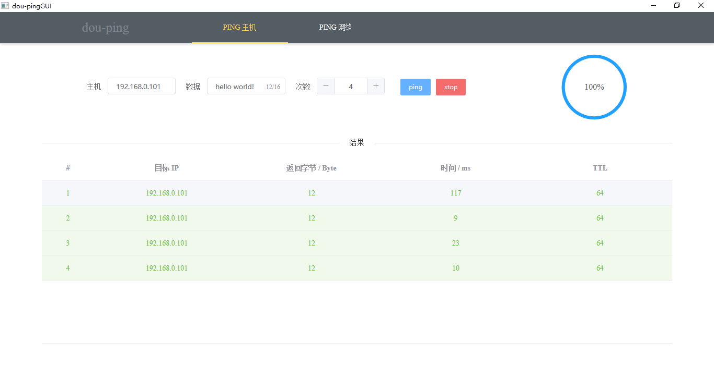
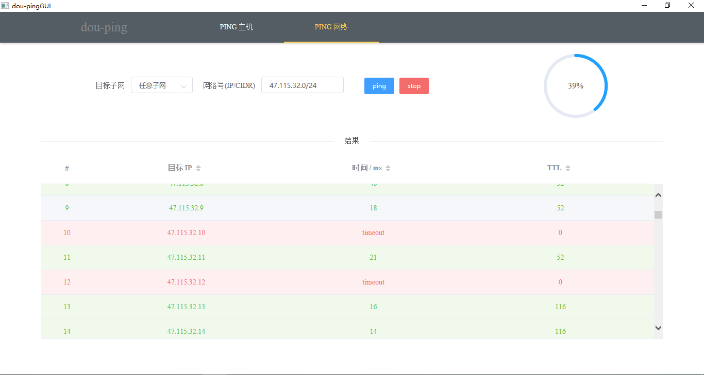

# dou-pingGUI

## Introduction

go 语言实现的 ping 桌面应用程序。基于 [Wails](https://github.com/wailsapp/wails) 框架，前端基于 Vue.js 。

## Features

- Ping any host
- Ping all hosts in any subnet

## Usage

Download the executable file in [release](https://github.com/99MyCql/dou-pingGUI/releases).

If on windows x86-64, you should download `dou-pingGUI-win64.exe`. Then, double click it:





## Development

### Environment

My basic environment are:

- Go 1.14
- npm 6.4.1
- Wails 1.0.2
- Vue 2.5.22

### Debug

Enter the project directory:

```bash
cd dou-pingGUI/
```

Run backend:

```bash
wails serve
```

Run frontend:

```bash
cd frontend/
npm run serve
```

Then, you can debug the application in web browser.

### Build

```bash
cd dou-pingGUI/
wails build -p
```

This will package up the application into a platform-native format.

If on windows, you can get `dou-pingGUI.exe` in the project directory.

## Standard

### Git Commit Format

```git
git commit -m "type: description"
```

- type:
  - feat：新功能（feature）
  - fix：修补bug
  - docs：文档（documentation）
  - style：格式（不影响代码运行的变动）
  - refactor：重构（即不是新增功能，也不是修改bug的代码变动）
  - test：增加测试
  - chore：构建过程或辅助工具的变动

- description: 详细描述
